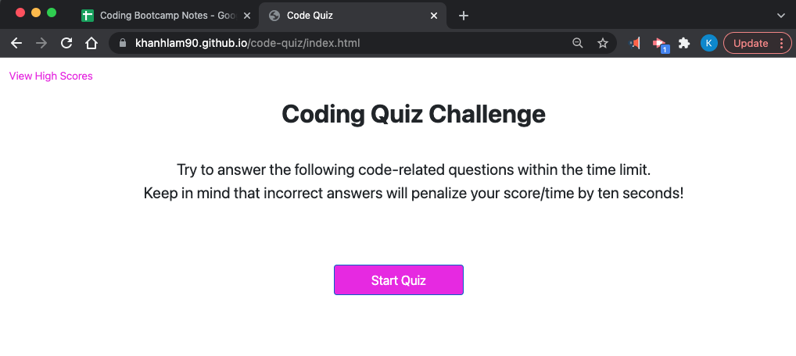
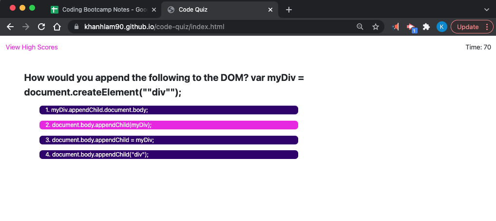
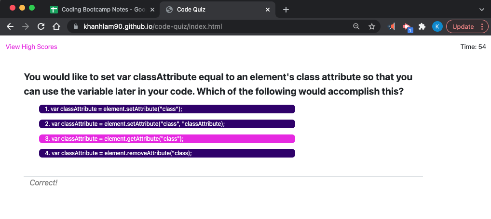
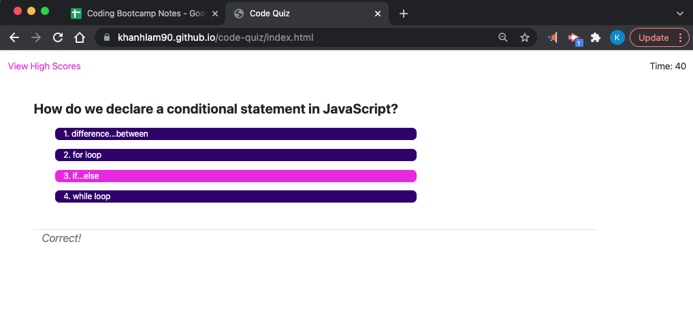
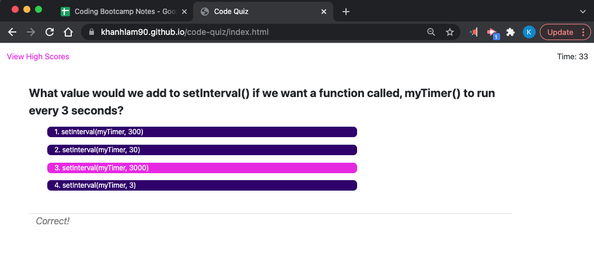
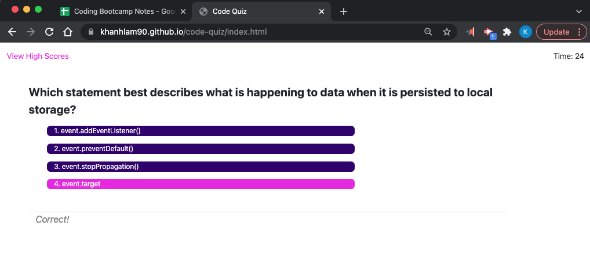
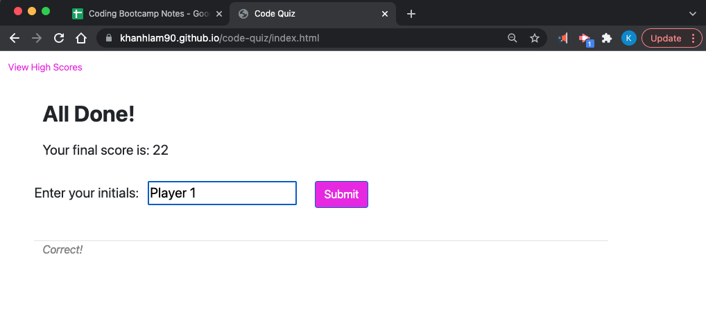
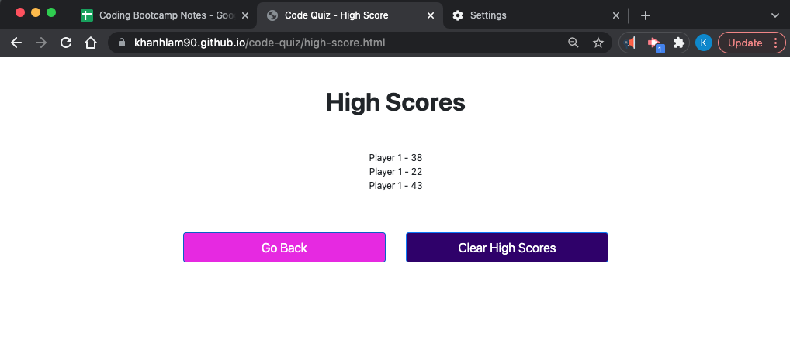

# Code Quiz

## Purpose
XXX
* XXX
* XXX
    - XXX
    - XXX
    - XXX
    - XXX

## Built With
* HTML
* CSS
* Javascript

## Website
Placeholder

## Contribution
Self-Built and online-research (such as https://stackoverflow.com/ and https://www.w3schools.com/)

## Screenshots demonstrates the web application's appearance and functionality:

### Notes
* Sample screenshots above demonstrate PLACEHOLDER
* Sample quiz questions are extracted from the course's module assessments.